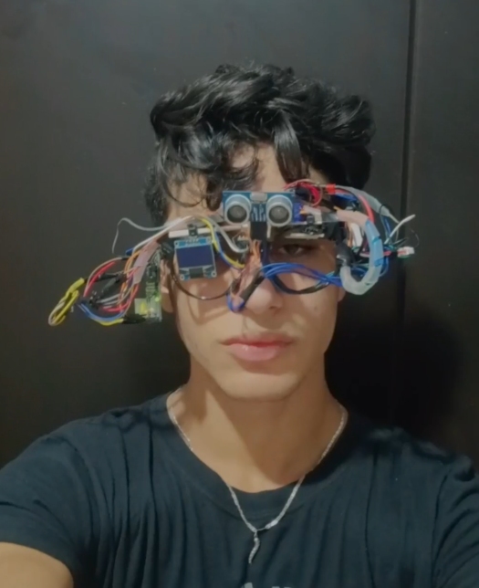
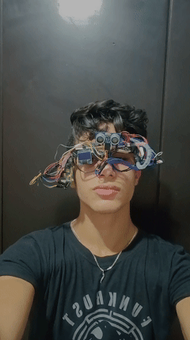

### Third Eye Project (TEP)
## Project Overview
The Third Eye Project (TEP) is an assistive technology device designed to help visually impaired individuals detect obstacles in their path. The device uses ultrasonic sensors to detect objects and provides audio feedback through a buzzer. An IMU (Inertial Measurement Unit) ensures the sensor maintains a forward-facing direction regardless of head tilt, while an OLED display provides visual feedback.

## How It Works
The system continuously monitors the user's head orientation using the MPU-9265 accelerometer. When the user tilts their head up or down, the servo motor compensates by adjusting the ultrasonic sensor to maintain a forward-facing direction. The ultrasonic sensor measures distance to obstacles, and the buzzer provides proportional audio feedback - slower beeps for distant objects and faster, more urgent beeps as obstacles get closer.

## Circuit Diagram :

#Power Connections:
3.3V: MPU-9265 VCC

5V: OLED VCC, Ultrasonic VCC, Servo VCC

GND: All components GND pins

# Digital Pins:
Pin 8: Buzzer positive

Pin 9: Ultrasonic Trig

Pin 10: Ultrasonic Echo

Pin 11: Servo Signal

# I2C Pins (Shared):
A4 (SDA): MPU-9265 SDA, OLED SDA

A5 (SCL): MPU-9265 SCL, OLED SCL

Important Notes:
# I2C Addresses:

MPU-9265: 0x68

OLED Display: 0x3C

# Power Considerations:

Use external power supply if servo draws too much current

MPU-9265 requires 3.3V (do not connect to 5V)

# Signal Levels:

Ultrasonic operates at 5V logic

MPU-9265 operates at 3.3V logic

I2C pull-up resistors may be needed

### Pseudo Code :

INCLUDE necessary libraries

DEFINE pins for all components
INITIALIZE variables for:
  - IMU data (pitch, roll, yaw)
  - Distance measurement
  - Servo position
  - Buzzer frequency and timing

SETUP:
  INITIALIZE I2C communication
  INITIALIZE IMU sensor
  INITIALIZE OLED display
  INITIALIZE servo motor
  INITIALIZE ultrasonic sensor pins
  INITIALIZE buzzer pin
  DISPLAY startup eye image on OLED

LOOP:
  // IMU Processing
  READ accelerometer and gyroscope data from MPU-9265
  CALCULATE pitch angle from IMU data
  MAP pitch angle to servo position (compensate for head tilt)
  UPDATE servo position to keep ultrasonic sensor forward-facing
  
  // Distance Sensing
  TRIGGER ultrasonic sensor
  MEASURE echo time
  CALCULATE distance in centimeters
  
  // Audio Feedback
  IF distance < 200 cm THEN
    MAP distance to buzzer frequency (closer = higher frequency)
    MAP distance to beep interval (closer = shorter intervals)
    ACTIVATE buzzer with calculated parameters
  ELSE
    DEACTIVATE buzzer
  END IF
  
  // Visual Feedback
  UPDATE OLED display with eye image
  OPTIONALLY display distance information
  

  DELAY for stable operation

